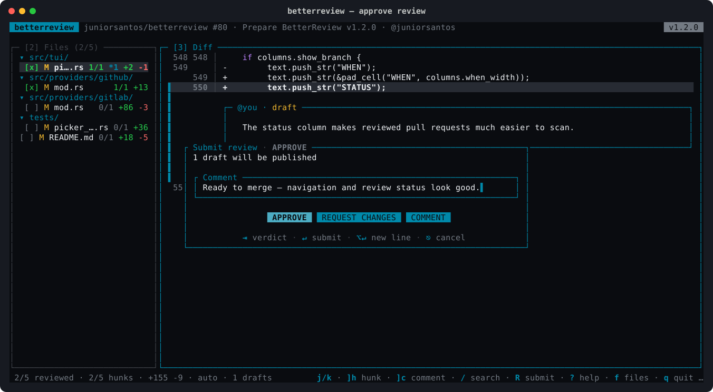

# betterreview

[](https://github.com/juniorsantos/betterreview/actions/workflows/ci.yml)

🇧🇷 [Leia em Português](README_PT_BR.md)

Terminal code review for GitHub pull requests and GitLab merge requests. Navigate the diff with vim/lazygit-style keys, comment inline just like on GitHub, mark files as reviewed and submit your review — without leaving the terminal.


When launched inside a repository, the picker lists open reviews, shows the status for the current HEAD and prefetches the highlighted PR:


Approve, request changes or comment without losing the diff and draft context behind the modal:



## Features

- Diff with GitHub visual parity: edge-to-edge green/red backgrounds, a single line-number column, file name on top and expandable hidden context (`z`)
- Inline comments as cards: create (`c`), edit (`e`), delete (`x`), reply (`r`) and code suggestions (`s`)
- Line or block selection (`v`) to comment exactly like on GitHub
- Clean clipboard copying: current line or selection (`y`) and current hunk (`Y`)
- Portable review sharing: raw patch hunk (`p`) or every comment as Markdown (`C`)
- Clickable terminal links for the review, current HEAD commit and active file on GitHub or GitLab
- File tree with reviewed checkboxes (`m`), collapsible folders and de-emphasized generated files
- Quick jumps: first/last diff row or file (`gg`/`G`), next hunk (`]h`), next comment (`]c`), next file (`]f`), next unreviewed (`]u`)
- In-diff search (`/`, `n`/`N`), mouse support (scroll and click)
- Persistent sessions: quit and resume the review where you left off (`betterreview resume`)
- Review status tied to the current HEAD: a new commit automatically returns the review to unreviewed
- Full review submission (`R`): approve, request changes or comment

## Comparison

betterreview is a review client, not a diff viewer: it reads the pull request, keeps your progress, and publishes the review back to the forge. That is the axis this table compares.

| Capability | [betterreview](https://github.com/juniorsantos/betterreview) | [hunk](https://github.com/modem-dev/hunk) | [lumen](https://github.com/jnsahaj/lumen) | [gh](https://cli.github.com) / [glab](https://gitlab.com/gitlab-org/cli) | [delta](https://github.com/dandavison/delta) |
| --- | --- | --- | --- | --- | --- |
| GitHub **and** GitLab | ✅ | ❌ | ❌ | one each | ❌ |
| Publishes the review to the forge | ✅ | ❌ | ❌ | ✅ | ❌ |
| Inline comments on a line or selection | ✅ | ❌ | ❌ | ❌ | ❌ |
| Replies and thread resolution | ✅ | ❌ | ❌ | ❌ | ❌ |
| Code suggestions | ✅ | ❌ | ❌ | ❌ | ❌ |
| Approve / request changes | ✅ | ❌ | ❌ | ✅ | ❌ |
| Per-file and per-hunk progress | ✅ | ❌ | per file | ❌ | ❌ |
| Session survives quitting | ✅ | ❌ | ❌ | — | ❌ |
| Review-first interactive TUI | ✅ | ✅ | ✅ | ❌ | ❌ |
| Side-by-side and unified | ✅ | ✅ | ✅ | ❌ | ✅ |
| Expandable hidden context | ✅ | ✅ | ✅ | ❌ | ❌ |
| Search inside the diff | ✅ | ✅ | ✅ | ❌ | ❌ |
| Mouse support | ✅ | ✅ | ✅ | ❌ | ❌ |
| Syntax highlighting | via delta | ✅ | ✅ | ❌ | ✅ |
| Needs no AI provider key | ✅ | ✅ | for AI features | ✅ | ✅ |
| Agent annotation bridge | [planned](https://github.com/juniorsantos/betterreview/issues/6) | ✅ | ✅ | ❌ | ❌ |
| Reviews a local diff without a PR | [planned](https://github.com/juniorsantos/betterreview/issues/22) | ✅ | ✅ | ❌ | ✅ |
| Works as a pager / difftool | ❌ | ✅ | ❌ | ❌ | ✅ |
| Structural diffing | ❌ | ❌ | ❌ | ❌ | ❌ |

`gh` and `glab` publish reviews, but each speaks to one forge and neither renders the diff for review — you comment by file and line number, not by pointing at the code. `hunk` and `lumen` are diff viewers with local annotations: excellent for reading a changeset, but the review never reaches the pull request.


## Dependencies

| Tool | Purpose | Install |
|---|---|---|
| [git](https://git-scm.com) | repository context | ships with macOS/Linux |
| [gh](https://cli.github.com) | GitHub PRs (`gh auth login`) | `brew install gh` |
| [glab](https://gitlab.com/gitlab-org/cli) | GitLab MRs (`glab auth login`) | `brew install glab` |
| [delta](https://github.com/dandavison/delta) | diff rendering | `brew install git-delta` |

Run `betterreview doctor` to check that everything is ready.

## Installation

### Homebrew (macOS and Linux)

```sh
brew tap juniorsantos/tap
brew install betterreview
```

Or in a single command: `brew install juniorsantos/tap/betterreview`.

Installs `gh`, `glab` and `delta` automatically as dependencies.

### Release binary

Download the binary for your platform from the [releases page](https://github.com/juniorsantos/betterreview/releases):

```sh
# macOS Apple Silicon
VERSION=v1.2.0
curl -sSL "https://github.com/juniorsantos/betterreview/releases/download/${VERSION}/betterreview-${VERSION}-aarch64-apple-darwin.tar.gz" | tar xz
sudo mv betterreview /usr/local/bin/
```

Available targets: `aarch64-apple-darwin`, `x86_64-apple-darwin`, `x86_64-unknown-linux-gnu`.

### Via cargo

```sh
cargo install --git https://github.com/juniorsantos/betterreview
```

## Usage

```sh
# inside a repository: opens the picker with the open PRs/MRs
betterreview

# directly by URL
betterreview https://github.com/owner/repo/pull/42

# resume the last review session
betterreview resume

# list saved sessions
betterreview sessions

# check dependencies and authentication
betterreview doctor
```

### Shell completions

Homebrew installs them automatically. For other installs:

```sh
betterreview completions zsh  > ~/.zfunc/_betterreview     # zsh
betterreview completions bash > ~/.local/share/bash-completion/completions/betterreview
betterreview completions fish > ~/.config/fish/completions/betterreview.fish
```

### Main shortcuts

| Key | Action |
|---|---|
| `j`/`k` | move cursor |
| `gg` / `G` | jump to the first / last diff row or file |
| `Tab`, `2`/`3` | switch focus between Files and Diff |
| `v` | start/end line selection |
| `c` | comment on the line or selection |
| `s` | suggest code on the selection |
| `y` / `Y` | copy the current line or selection / current hunk |
| `p` / `C` | copy the current raw patch hunk / all comments as Markdown |
| `e` / `x` / `r` | edit / delete / reply to the comment under the cursor |
| `m` | mark file as reviewed |
| `z` | expand hidden diff context (or collapse folder in the Files panel) |
| `]h` `[h` / `]c` `[c` | next/previous hunk / comment |
| `]f` `[f` / `]u` `[u` | next/previous file / unreviewed file |
| `/`, `n`/`N` | search in the diff |
| `R` | submit review (approve / request changes / comment) |
| click `#PR`, head hash or active file | open the link in the default browser |
| `Ctrl+Z` | suspend to the shell (`fg` returns to the review) |
| `?` | help with all shortcuts |
| `q` | quit |

## Development

```sh
cargo test          # full suite
cargo clippy --all-targets -- -D warnings
cargo fmt --all --check
cargo run --example readme_screenshots
```

Releases are automated: `feat:`/`fix:` commits on `main` produce a semantic version bump, tag and release with binaries via GitHub Actions.

## License

Distributed under the MIT License. See [LICENSE](LICENSE) and [NOTICE](NOTICE).
