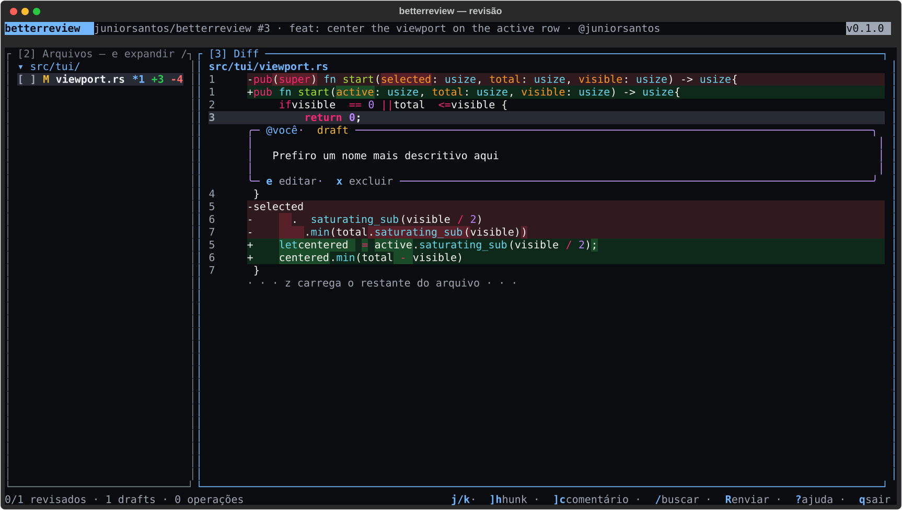
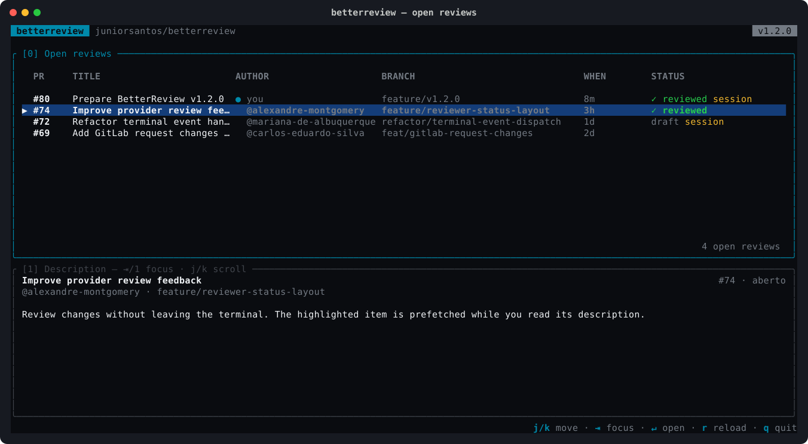

# betterreview

[](https://github.com/juniorsantos/betterreview/actions/workflows/ci.yml)

🇺🇸 [Read in English](README.md)

Revisão de código no terminal para pull requests do GitHub e merge requests do GitLab. Navegue o diff com teclas estilo vim/lazygit, comente inline como no GitHub, marque arquivos como revisados e envie a revisão — sem sair do terminal.



Rodando dentro de um repositório, o seletor lista as revisões abertas e já faz o prefetch do PR destacado:



## Recursos

- Diff com paridade visual com o GitHub: fundo verde/vermelho fim a fim, uma única coluna de número de linha, nome do arquivo no topo e trechos ocultos expansíveis (`z`)
- Comentários inline em cartões: criar (`c`), editar (`e`), excluir (`x`), responder (`r`) e sugestões de código (`s`)
- Seleção de linha ou bloco (`v`) para comentar exatamente como no GitHub
- Arquivos em árvore com checkbox de revisado (`m`), pastas recolhíveis e arquivos gerados de-emfatizados
- Saltos rápidos: próximo hunk (`]h`), próximo comentário (`]c`), próximo arquivo (`]f`), próximo não revisado (`]u`)
- Busca no diff (`/`, `n`/`N`), suporte a mouse (scroll e clique)
- Sessão persistente: feche e retome a revisão de onde parou (`betterreview resume`)
- Envio da revisão completa (`R`): aprovar, solicitar mudanças ou comentar

## Dependências

| Ferramenta | Para quê | Instalação |
|---|---|---|
| [git](https://git-scm.com) | contexto do repositório | já vem no macOS/Linux |
| [gh](https://cli.github.com) | PRs do GitHub (`gh auth login`) | `brew install gh` |
| [glab](https://gitlab.com/gitlab-org/cli) | MRs do GitLab (`glab auth login`) | `brew install glab` |
| [delta](https://github.com/dandavison/delta) | renderização do diff | `brew install git-delta` |

Rode `betterreview doctor` para verificar se está tudo pronto.

## Instalação

### Homebrew (macOS e Linux)

```sh
brew install juniorsantos/tap/betterreview
```

Instala `gh` e `delta` automaticamente como dependências. Para GitLab, rode também `brew install glab`.

### Binário do release

Baixe o binário da sua plataforma na [página de releases](https://github.com/juniorsantos/betterreview/releases):

```sh
# macOS Apple Silicon
curl -sSL https://github.com/juniorsantos/betterreview/releases/latest/download/betterreview-v0.1.0-aarch64-apple-darwin.tar.gz | tar xz
sudo mv betterreview /usr/local/bin/
```

Targets disponíveis: `aarch64-apple-darwin`, `x86_64-apple-darwin`, `x86_64-unknown-linux-gnu`.

### Via cargo

```sh
cargo install --git https://github.com/juniorsantos/betterreview
```

## Uso

```sh
# dentro de um repositório: abre o seletor de PRs/MRs abertos
betterreview

# direto por URL
betterreview https://github.com/owner/repo/pull/42

# retomar a última sessão de revisão
betterreview resume

# listar sessões salvas
betterreview sessions

# checar dependências e autenticação
betterreview doctor
```

### Atalhos principais

| Tecla | Ação |
|---|---|
| `j`/`k` | mover cursor |
| `Tab`, `2`/`3` | alternar foco entre Arquivos e Diff |
| `v` | iniciar/encerrar seleção de linhas |
| `c` | comentar na linha ou seleção |
| `s` | sugerir código na seleção |
| `e` / `x` / `r` | editar / excluir / responder comentário sob o cursor |
| `m` | marcar arquivo como revisado |
| `z` | expandir trecho oculto do diff (ou recolher pasta no painel Arquivos) |
| `]h` `[h` / `]c` `[c` | próximo/anterior hunk / comentário |
| `]f` `[f` / `]u` `[u` | próximo/anterior arquivo / arquivo não revisado |
| `/`, `n`/`N` | buscar no diff |
| `R` | enviar revisão (aprovar / solicitar mudanças / comentar) |
| `?` | ajuda com todos os atalhos |
| `q` | sair |

## Desenvolvimento

```sh
cargo test          # suíte completa
cargo clippy --all-targets -- -D warnings
cargo fmt --check
```

Releases são automáticos: commits `feat:`/`fix:` na `main` geram bump de versão semântica, tag e release com binários via GitHub Actions.

## Licença

Distribuído sob a licença MIT. Veja [LICENSE](LICENSE) e [NOTICE](NOTICE).
